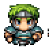

# Used in this project
- HTML
- CSS
- Typescript
- ESLint
- Prettier
- Vite
- Visual Studio Code

# About the project
This is a hero based walking on tiles and killing monsters type of game. The hero 
is controlled in a maze using the keyboard. The Hero and monsters have levels and
stats depending on their levels. The goal is to reach the highest level by killing
the monsters holding the keys to the next level.

# Characters
- Every character has a (max and current) health point (HP), a defend (DP) and
  strike point (SP).
- These values can change during the game.
- When a character's health point is 0 or below, it is dead.
  - It disappears from the area.
  - If its the hero, it is the end of the game.

### Hero

### Monsters
| Boss                     | Skeleton                          |
| ------------------------ | --------------------------------- |
|  |  |

# Map
| Floor tile                 | Wall tile                 |
| -------------------------- | ------------------------- |
|  |  |

The map is built up from two different tiles, `floor` and `wall` tiles. Both Hero and 
the Monsters can walk on the floor tiles and neither of them on the walls. Characters can not move out from the bouderies of the map.
The map is generated randomly when the page loads.

# Moving

### Hero
The player controls the hero with their keyboard. `Arrow buttons` and `WASD` are
accepted to move the Hero. Hero only can walk on floor tiles, not on wall tiles.

### Monsters
All of the Monsters are moving in the same time, one tile a second in completely random directions. Like the Hero, Monsters as well can only walk on floor tiles. 
If the tile in the random direction where they would move is occupied by a wall tile or an other Monster character, the algorithm will generate more random directions. If the number of generated directions reaches 10, and none of them 
were acceptable directions to move the Monster to, then that Monster will stay in 
place, and will try to move in the next second with the other Monsters again.

# Stats
(d6 is a random number between 1 and 6 aka 6 sided die roll)\
(`X` is the current level of the character)
- Hero:
  - HP: 20 + 3 \* d6
  - DP: 2 \* d6
  - SP: 5 + d6
- Skeleton Level X:
  - HP: 2 \* X \* d6
  - DP: X/2 \* d6
  - SP: X \* d6
- Boss Level X:
  - HP: 2 \* X \* d6 + d6
  - DP: X/2 \* d6 + d6 / 2
  - SP: X \* d6 + X

# Battle
- When a character enters a tile which is occupied by an other, a battle forms.
  - In battle, the characters can not move.
- The character entering the occupied tile is the attacker.
  - If the attacker is a Monster, it will attack the Hero.
  - If the attacker is the Hero, the player will have 5 seconds to attack the Monster with pressing `space` on their keyboard.\
  If during this 5 seconds the player does not attack, the Monster will become the attacker and starts attacking the Hero.
- The attacker strikes on the defender, then the defender strikes and this
  continues until one of the characters dies.
- After a won battle if the character is the Hero, it levels up.

# Strike

- On a strike a strike value (SV) is calculated from SP and a d6 doubled.
- The strike is successful if 2 \* d6 + SP is higher than the other character's
  DP.
- On a successful strike the other character's HP is decreased by the SV - the
  other character's DP.

# Hero leveling

- After successfully won battle the Hero is leveling up.
- Max HP increases by d6.
- DP increases by d6.
- SP increases by d6.

# Entering next map level
For the Hero to be able to go to the next level of the map, the player must kill the Boss, and find a key to the next level. One of the Skeletons has this key and the player can get it upon killing the Skeleton who is holding the key.

When the Boss is dead and the Hero has the key to the next level, then the current level is won. A screen will appear, informing the player about this, 
and the player can click a button to go to the next level.

The next level looks like the previous one just with new and higher level Monsters.

When entering a new level the hero has:
- 10% chance to restore all their HP.
- 40% chance to restore the third of their Max HP.
- 50% chance to restore 10% of their Max HP.
